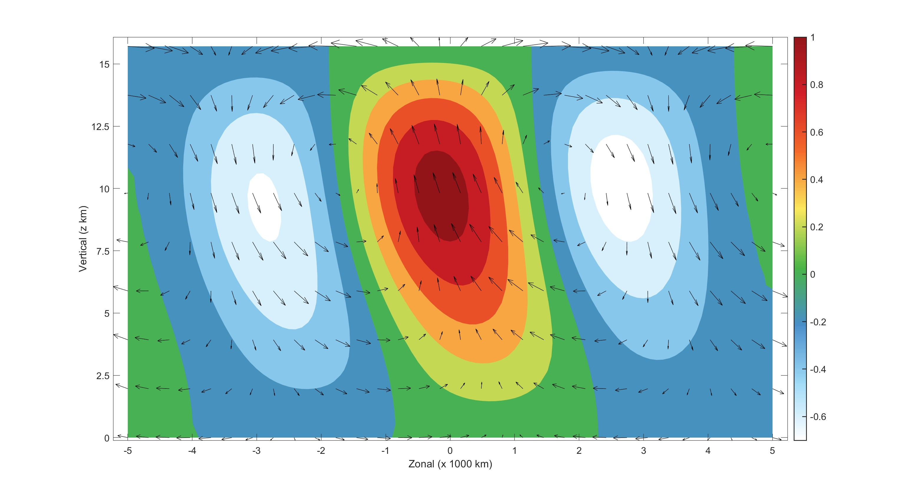
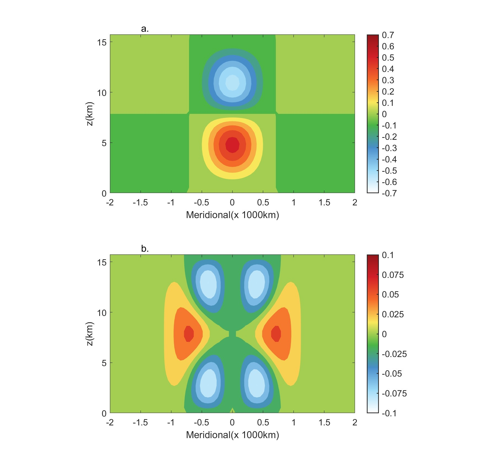
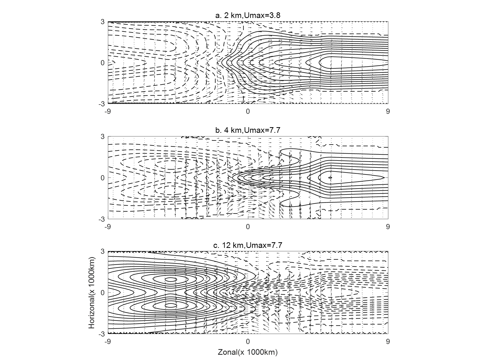
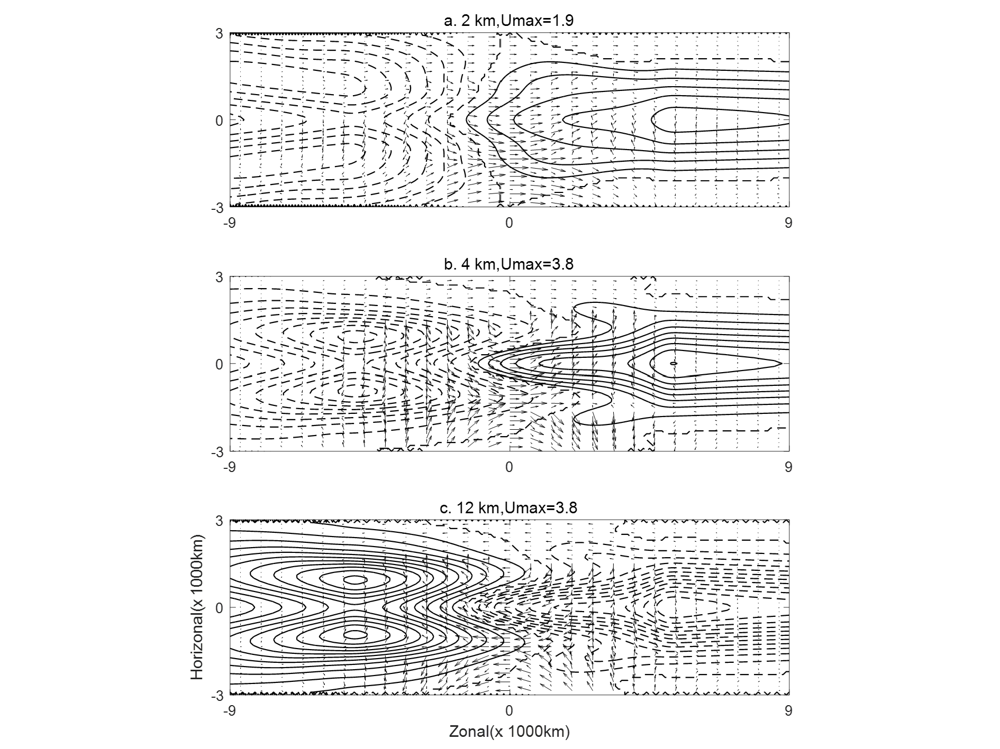

# Intraseasonal Planetary Equatorial Synoptic Dynamics (IPESD) Model

## Overview

This project provides MATLAB scripts for simulating the **Intraseasonal Planetary Equatorial Synoptic Dynamics (IPESD) model**, a multi-scale framework designed to investigate the upscale impacts of **Convectively Coupled Kelvin Waves (CCKWs)** on the **Madden–Julian Oscillation (MJO)**. The model follows the governing equations derived by **Majda & Biello (2004, 2005)** and couples synoptic-scale perturbations with planetary-scale responses through **Eddy Momentum Transport (EMT)** and **Eddy Heat Transport (EHT)**.

Key features:

* Multi-scale decomposition of atmospheric variables: weather-scale perturbations and planetary-scale envelopes.
* Explicit representation of vertical heating profiles for deep convection and stratiform clouds.
* Analytic computation of EMT and EHT as forcing terms for planetary-scale waves.
* Quasi-linear solution method for efficient simulation of large-scale MJO responses.
* Adjustable synoptic-scale heating profiles to explore different CCKW structures.

---

## Model Setup

1. **Synoptic-scale heating — governed by the synoptic-scale equatorial weak temperature gradient (SEWTG) equations:**  
   * Defines vertical and horizontal heating profiles for deep convection and stratiform clouds.
   * Heating region is idealized in the Indian Ocean with a width of 5000 km.
   * Includes the first and second baroclinic modes representing deep convective heating and stratiform heating, respectively.

2. **Planetary-scale response — governed by the quasilinear equatorial long-wave (QLELWE) equations:**  
   * Driven by EMT and EHT computed from SEWTG solutions.
   * Solved using spectral Hermite modal decomposition for baroclinic modes.

3. **Coupling Mechanism:**  
   * Synoptic-scale heating → EMT/EHT → forcing of the QLELWE system → planetary-scale circulation response.

---

## Scripts Overview

| Script                     | Description                                                                                   |
| --------------------------- | --------------------------------------------------------------------------------------------- |
| `IPESD-syn.m`              | Defines synoptic-scale heating; computes velocity, temperature, and pressure perturbations.   |
| `IPESD-main.m`             | Solves planetary-scale QLELWE using Hermite spectral decomposition; generates response fields. |
| `data/`                     | Stores intermediate and output matrices (`l`, `v`, `r`) representing planetary-scale responses. |

---

## Example Usage

```matlab
% Step 1: Define synoptic-scale heating
run('IPESD-syn.m');

% Step 2: Solve planetary-scale equations
run('IPESD-main.m');

% Step 3: Load results and visualize
load('data/l01.txt'); % Example output: zonal velocity
imagesc(l); colorbar; xlabel('Longitude'); ylabel('Time');
```

## Users Guide

Users can adjust the relative ratio and phase between synoptic-scale stratiform and deep convective heating to simulate different CCKW structures.
The output matrices represent planetary-scale circulation responses and can be used for further diagnostic analyses.

---

## Key Parameters

| Parameter        | Description               | Value / Unit          |
|-----------------|---------------------------|---------------------|
| e               | Froude number             | 0.125               |
| x_scale, y_scale| Synoptic-scale dimensions | 1500 km × 1500 km   |
| HT              | Tropopause height         | 16 km               |
| u_scale,v_scale | Horizontal velocity scale | 6.25 m/s            |
| w_scale         | Vertical velocity scale   | 0.025 m/s           |
| d               | Momentum drag rate        | 0.18 day⁻¹          |

*(Complete parameters are consistent with Biello & Majda 2005.)*

---

## Figures

### Synoptic-scale Heating and Velocity Fields
<p align="center">
  
</p>

### EMT and EHT
<p align="center">
  
</p>

### Planetary-scale Response: Fast-propagating MJO
<p align="center">
  
</p>

### Planetary-scale Response: Slow-propagating MJO
<p align="center">
  
</p>

---

## References

* Biello, J. A., and A. J. Majda, 2005: A New Multiscale Model for the Madden–Julian Oscillation. Journal of the Atmospheric Sciences, 62, 1694–1721, https://doi.org/10.1175/JAS3455.1. *
* Majda, A. J., and J. A. Biello, 2004: A multiscale model for tropical intraseasonal oscillations. Proceedings of the National Academy of Sciences, 101, 4736–4741, https://doi.org/10.1073/pnas.0401034101. *
* Majda, A.J. and Klein, R., 2003: Systematic multiscale models for the tropics. Journal of the Atmospheric Sciences, 60(2), 393-408, [https://doi.org/10.1175/1520-0469(2003)060<0393:SMMFTT>2.0.CO;2](https://doi.org/10.1175/1520-0469(2003)060%3C0393:SMMFTT%3E2.0.CO;2). *

## License

This project is licensed under the MIT License. See the [LICENSE](LICENSE) file for details.

---

